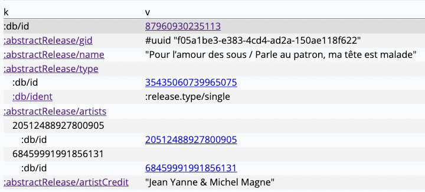

# Datomic browser — Electric Clojure example

Live app hosted in Paris and New Jersey: https://electric-datomic-viewer.fly.dev/

Today, Cognitect's REBL and other GUI data browsers are architected as desktop applications, because their expressive power comes from the **datafy/nav programming model**, where the GUI view process is co-located with the backend data sources, so that the view can directly query and traverse backend data structures as if at the REPL (data-navigate = fn composition). 

The consequence of this co-located architecture is that these data browsers are historically not architected as web applications, because the **frontend/backend web app plumbing breaks composition**, which in turn breaks the data-nav=composition programming model. And that means we can't run these in prod, we they aren't linkable/sharable, and worst of all, we can't use the flexible and dynamic programming model based on data-nav=composition to power mission-critical web applications that match how people think.

Electric Clojure solves this at the technical layer by using **stream functions** to abstract over the frontend/backend web boundary, permitting a data-nav=composition programming model to work with high performance despite the client/server architecture.

https://user-images.githubusercontent.com/124158/219978031-939344eb-4489-4b97-af9f-4b2df38c70db.mp4

*Video: this web-based data browser achieves high performance while still being coded in the data-nav=composition programming model.*

What's happening:

* full-stack web application
* Datomic Cloud database is on the backend
* Dynamic web frontend with filtering, query parameters, routing, web history, tree views
* Pagination is server-streamed and renders as an efficient virtual scroll.

The key idea here is not what the demo does, but how it is expressed in code:

* Demo is a single file namespace, 228 LOC: [datomic_browser.cljc](https://github.com/hyperfiddle/electric-datomic-browser/blob/main/src/app/datomic_browser.cljc)
* the application is an expression, the entrypoint [user.cljs](https://github.com/hyperfiddle/electric-datomic-browser/blob/7617d72a34a68223459e2691299bd46283cd334d/src/user.cljs#L9) calls a single Electric function, that's it!
* The grid cell renderers, despite rendering on the frontend, have full backend access as if co-located. 

Concretely, on the Entity Detail page, the valueType and cardianlity column renderers can query the entity schema metadata directly, and intelligently resolve `:db/ident` when available, so that a dynamic renderer can display the most human-friendly identity representation available:



*Screenshot: the dynamic entity detail view from this Datomic browser.*

In this screenshot,
* the frontend key renderer queries backend schema to check if it matches a schema attr, hyperlinks to schema detail if so [L73-L74](https://github.com/hyperfiddle/electric-datomic-browser/blob/7617d72a34a68223459e2691299bd46283cd334d/src/app/datomic_browser.cljc#L73-L74)
* the frontend key renderer queries backend schema to check for human readable attr names [L13-L20](https://github.com/hyperfiddle/electric/blob/a1907db5b77931f777205b0fb6b15722154435d8/src/contrib/datomic_contrib.clj#L13-L20)
* Because it's dynamic, this view works on any tree data structure, not just Datomic entities. That's why the `k` column renderer can expand into collections as a tree, with an 

All of this is done inline in the cell renderer, **without any non-local coordination** to prefetch, batch, cache or mirror entities on the frontend in a client-side db for fast lookups. All that crap is gone—**all app logic is local!**—which means it is easy to reason about. With Electric, as programmers, we no longer need to think about or even care which site their data source exists at. Simply use what you need, and Electric will take care of the plumbing. De-load your mind and relax!

In essence, Electric's property of **"network-transparent composition"** is designed to make possible a datafy/nav implementation that spans the client/server network chasm, all in a way designed to compose seamlessly with dynamic web frontend libraries. Therefore, we think bringing this browser demo to parity with, say, Cognitect REBL (but for the web) is a straightforward exercise. And not just that—we can now use data-nav=composition abstractions as a foundation for full-on applications.

This is the technical thesis of the Hyperfiddle project. Now armed with network-transparent composition, how much further can our programming abstractions scale, before reaching performance limits that leak incidental platform implementation details/plumbing, that have nothing to do with the business problem at hand? What % of the LOC that we write today, is spent dealing with leaky abstractions?

# Dependencies

* Datomic Pro (now free!)
* [Electric Clojure](https://github.com/hyperfiddle/electric)
* hyperfiddle.history (bundled with Electric) – experimental composable router
* datomic/missionary adapter (bundled with Electric) – experimental streaming adapter for Datomic

# Getting Started

```
$ ./datomic_fixtures.sh    # create datomic db, download and seed with mbrains sample data
$ state/datomic-pro/bin/transactor config/samples/dev-transactor-template.properties >>state/datomic.log 2>&1 &
$ clj -A:dev -X user/main

Starting Electric compiler and server...
shadow-cljs - server version: 2.22.10 running at http://localhost:9630
shadow-cljs - nREPL server started on port 9001
[:dev] Configuring build.
[:dev] Compiling ...
Datomic APIs detected:  #{datomic.client.api.async datomic.client.api}
[:dev] Build completed. (225 files, 1 compiled, 0 warnings, 4.69s)

👉 App server available at http://0.0.0.0:8080
```

# Deployment

```
fly status
fly platform vm-sizes
fly scale show
fly scale vm shared-cpu-8x # for 2gb ram
fly regions list
fly regions add ewr gru sjc cdg
fly scale count 1 --region ewr
fly scale count 1 --region cdg
fly scale count 1 --region sjc
fly scale count 1 --region gru
```